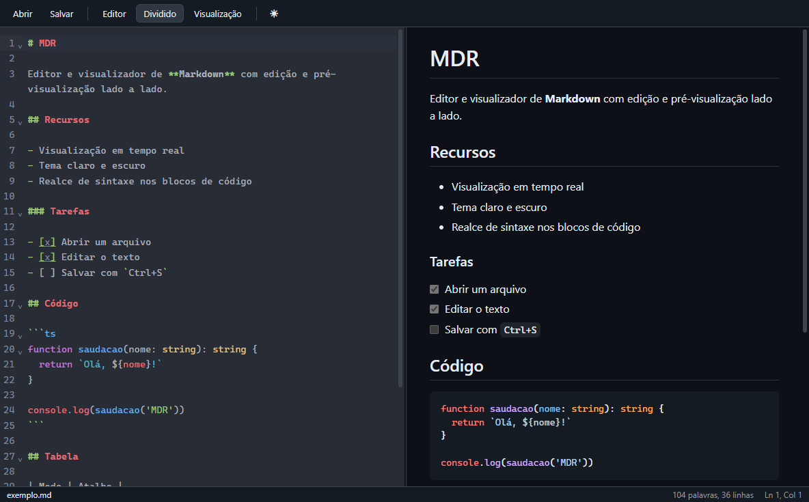
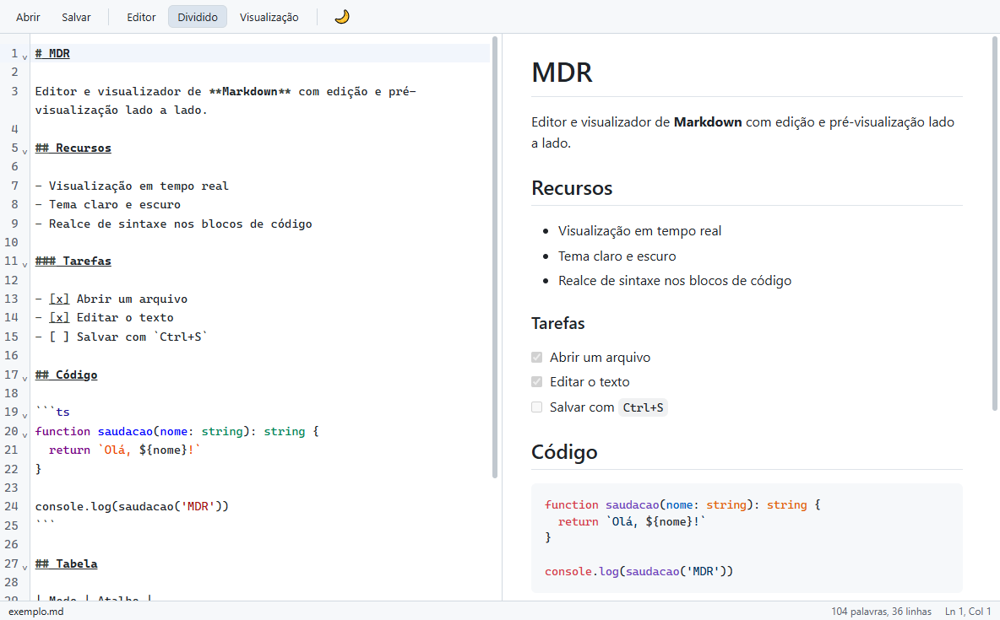

# MDR

Editor e visualizador de Markdown para desktop (Windows), com edição e pré-visualização lado a lado.

Feito com Electron 44, electron-vite 5, Vite 7 e TypeScript. O editor usa CodeMirror 6 e a visualização usa markdown-it (com listas de tarefas), highlight.js e DOMPurify. O instalador é gerado com electron-builder (NSIS).

Repositório: <https://github.com/RKXP-Software/MDR>

## Capturas de tela





## Funcionalidades

- Editor CodeMirror 6 com realce de sintaxe Markdown (e de blocos de código nas linguagens suportadas), numeração de linhas e quebra de linha automática.
- Visualização em tempo real (atualizada ~150 ms após a digitação), com:
  - realce de sintaxe em blocos de código (highlight.js);
  - listas de tarefas (`- [ ]` / `- [x]`, somente leitura na visualização);
  - links automáticos, tipografia (aspas e travessões) e âncoras `#título` nos títulos;
  - imagens com caminho relativo, resolvidas a partir da pasta do documento aberto;
  - links `http`/`https` abrem no navegador padrão (e `mailto:` no cliente de e-mail).
- Três modos de exibição: somente editor, dividido e somente visualização. O modo escolhido é lembrado entre sessões.
- Divisor arrastável entre editor e visualização (a posição é lembrada; duplo clique volta para 50/50).
- Rolagem sincronizada do editor para a visualização no modo dividido.
- Tema claro/escuro: segue o tema do sistema por padrão. Pode ser escolhido em Exibir > Tema (Sistema, Claro, Escuro) ou alternado com `Ctrl+Shift+T` ou pelo botão na barra de ferramentas; a escolha é persistida.
- Barra de status com nome do arquivo, indicador `modificado`, contagem de palavras e linhas, e posição do cursor (`Ln`, `Col`).
- Título da janela com o nome do arquivo e `•` quando há alterações não salvas.
- Pergunta se deseja salvar ao fechar a janela ou trocar de documento com alterações pendentes.
- Abrir arquivo por: menu, botão, arrastar e soltar na janela, linha de comando ou associação de arquivo (`.md`, `.markdown`).
- Instância única: abrir outro arquivo com o app já aberto reaproveita a janela existente.
- Zoom e tela cheia pelo menu Exibir.

Extensões reconhecidas ao abrir: `.md`, `.markdown`, `.mdown`, `.mkd`, `.mkdn`, `.mdwn`, `.mdtxt`, `.mdtext`. Arquivos são lidos como UTF-8 ou, se não forem UTF-8 válido, como Windows-1252, e gravados de volta na mesma codificação, preservando BOM e fim de linha (CRLF/LF); se o texto tiver caracteres que a Windows-1252 não representa, o MDR oferece salvar em UTF-8. Documentos novos são gravados em UTF-8 sem BOM, com LF. A gravação é atômica (arquivo temporário + renomear). Ao salvar sem extensão, `.md` é acrescentada.

## Atalhos de teclado

Todos vêm do menu da aplicação.

| Atalho | Ação | Menu |
| --- | --- | --- |
| `Ctrl+N` | Novo documento | Arquivo |
| `Ctrl+O` | Abrir | Arquivo |
| `Ctrl+S` | Salvar | Arquivo |
| `Ctrl+Shift+S` | Salvar como | Arquivo |
| `Ctrl+1` | Somente editor | Exibir |
| `Ctrl+2` | Dividido | Exibir |
| `Ctrl+3` | Somente visualização | Exibir |
| `Ctrl+Shift+T` | Alternar tema claro/escuro | Exibir |

O menu também oferece Desfazer, Refazer, Recortar, Copiar, Colar, Selecionar tudo, zoom (Tamanho original, Aumentar, Diminuir), Tela cheia e Ajuda > Sobre o MDR; esses itens usam os atalhos padrão do Electron/sistema. O editor traz ainda os atalhos padrão do CodeMirror (`basicSetup`) e `Tab` para indentar.

## Requisitos

- Node.js 20 ou superior (o `package.json` não define `engines`; o projeto foi desenvolvido com Node 24 e npm 10).
- npm.
- Windows para gerar o instalador (`npm run dist` executa `electron-builder --win`).

## Instalação e uso em desenvolvimento

```bash
npm install
npm run dev
```

Se o binário do Electron não for baixado durante o `npm install`, baixe-o manualmente:

```bash
node node_modules/electron/install.js
```

### Scripts

| Comando | O que faz |
| --- | --- |
| `npm run dev` | Inicia o app em modo de desenvolvimento (electron-vite dev), com ferramentas do desenvolvedor no menu Exibir |
| `npm run build` | Compila main, preload e renderer para `out/` |
| `npm run preview` | Executa o app a partir do build (`electron-vite preview`) |
| `npm run typecheck` | Verifica tipos (`tsconfig.node.json` e `tsconfig.web.json`) |
| `npm test` | Roda os testes (vitest, com jsdom) |
| `npm run dist` | Faz o build e gera o instalador NSIS para Windows em `release/` |

## Gerar o instalador

```bash
npm run dist
```

O instalador é gravado em `release/` com o nome `MDR-Setup-<versão>.exe` (por exemplo, `MDR-Setup-0.1.0.exe`). Ele permite escolher a pasta de instalação, instala por usuário (não exige administrador), cria atalho na área de trabalho e associa os arquivos `.md` e `.markdown` ao MDR.

## Abrir um arquivo pela linha de comando

Passe o caminho do arquivo Markdown como argumento (relativos são resolvidos a partir do diretório atual; argumentos que começam com `-` são ignorados):

```bash
# app instalado
MDR.exe C:\docs\notas.md

# em desenvolvimento
npm run dev -- ..\docs\notas.md
```

Se o MDR já estiver aberto, o arquivo é aberto na janela existente (com confirmação caso haja alterações não salvas).

## Estrutura do projeto

```
src/
  main/       Processo principal: janela, menu, diálogos, leitura/gravação de arquivos, IPC (index.ts, menu.ts, window.ts, files.ts)
  preload/    Ponte segura (contextBridge) que expõe window.mdr ao renderer
  renderer/   Interface: index.html e src/ (editor.ts, markdown.ts, theme.ts, view.ts, main.ts, estilos)
  shared/     Contrato compartilhado entre processos (api.ts: canais IPC e tipos)
electron-builder.yml   Configuração do instalador e da associação de arquivos
```

Saída de build em `out/`; instaladores em `release/`.

## Segurança

- A janela usa `contextIsolation: true`, `nodeIntegration: false` e `sandbox: true`; o renderer só acessa o sistema por meio da API do preload.
- O processo principal só aceita IPC do frame principal da janela principal e valida os tipos dos argumentos.
- O HTML da visualização é sanitizado com DOMPurify (sem scripts, manipuladores `on*`, URLs `javascript:`, `iframe`, `object`, `embed`, `form`, `style`/atributo `style`, `srcset` etc.). Recursos só são carregados de caminhos relativos, `http(s)` ou `data:image/*`, e requisições `file://` para hosts de rede são canceladas no processo principal.
- O executável empacotado tem os Electron fuses endurecidos (sem `ELECTRON_RUN_AS_NODE`, `NODE_OPTIONS` ou `--inspect`; app só de `app.asar` com verificação de integridade).
- Há Content-Security-Policy restritiva no `index.html`, navegação dentro da janela é bloqueada (apenas `http`, `https` e `mailto` abrem externamente) e todas as permissões do navegador (câmera, notificações etc.) são negadas.

## Limitações conhecidas

- "Novo" está disponível apenas pelo menu Arquivo (ou `Ctrl+N`); não há botão na barra de ferramentas.
- Imagens com caminho absoluto do Windows (por exemplo `C:\fotos\a.png`) não são exibidas; use caminhos relativos ao documento ou URLs `https`.
- Recursos em caminho de rede (`\\servidor\...`, `//servidor/...`) nunca são carregados na visualização, inclusive imagens relativas de um documento aberto de um compartilhamento de rede. Arrastar um arquivo de caminho de rede para a janela é recusado; use Arquivo > Abrir.
- O instalador não tem ícone próprio (usa o ícone padrão do Electron).
- A rolagem sincronizada funciona apenas do editor para a visualização.
- Uma janela por instância; um documento por vez.
